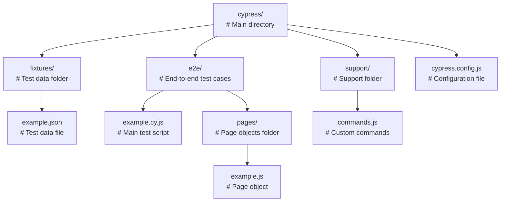
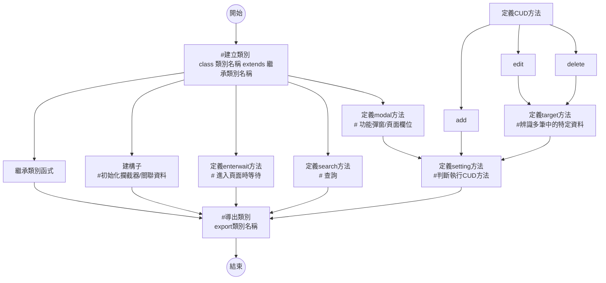

# TechnologyDemo
- **author:`Charley、Eric`**


## 目的
促使開發成員藉由各自擅長的技術領域，透過空閒的時間來完成網站專案，供作每位開發成員在求職時作品的呈現。

## 方法
以Eric正在經營的副業美式整骨為出發點，完成以下前後端分離作品
```
1.一頁式動態主頁
2.預約系統
3.周邊商品購物車
```

## 開發工具
Eric: VScode
Charley:

## 版本控制
Eric: GitHub
Charley:

## 程式語言(框架)
Eric: HTML、CSS、JavaS、JavaT(Vue)
Charley:


## 結構參考cypress



