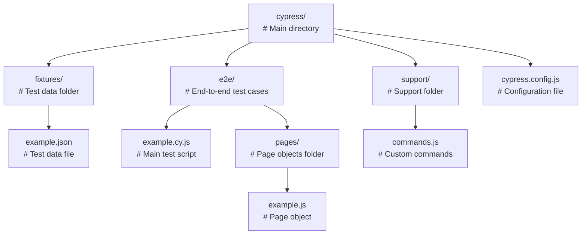

## 結構參考cypress

```mermaid
graph TD;
A[cypress/ \n # Main directory]
B[fixtures/ \n # Test data folder]
C[example.json \n # Test data file]
D[e2e/ \n # End-to-end test cases]
E[example.cy.js \n # Main test script]
F[pages/ \n # Page objects folder]
G[example.js \n # Page object]
H[support/ \n # Support folder]
I[commands.js \n # Custom commands]
J[cypress.config.js \n # Configuration file]

A --> B
B --> C
A --> D
D --> E
D --> F
F --> G
A --> H
H --> I
A --> J

```
